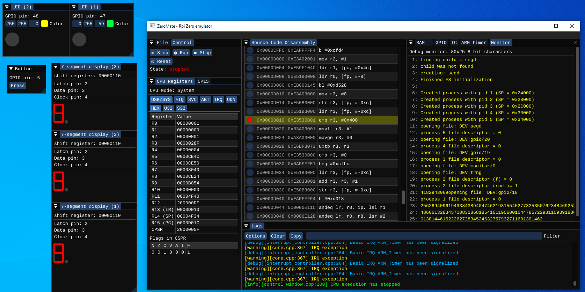

#  

*Raspberry Pi Zero Emulator*

---

## Description

ZeroMate is an educational Raspberry Pi Zero emulator designed specifically as a **debugging tool for operating system development**. Its ultimate goal is to emulate [KIV-RTOS](https://github.com/MartinUbl/KIV-RTOS) (more information about the operating system itself can be found [here](https://home.zcu.cz/~ublm/?page=vyuka&sub=os)). Please keep in mind that while using the emulator, certain features may be missing or limited as it is still under active development.

## Installation

The emulator was tested on both Windows and Linux using the MSVC and GCC compiler respectively. You can download a ready-to-use executable for both platforms from the latest [release](https://github.com/silhavyj/ZeroMate/releases). Alternatively, if you are brave enough, you can attempt to [build](docs/build.md) it yourself from the source code.

## User manual

Once the emulator is successfully built or downloaded, the [user manual](docs/user_manual.md) can be used as a brief description of how the application is intended to be used.

## Examples 

The emulator comes with a couple of prebuilt [examples](examples/README.md) that you are encouraged to try out to get an idea of what the emulator is capable of.

## Capabilities

|Feature|Support|Note|
|---|---|---|
|ARMv6 ISA|⏳| The vast majority of ARM instructions are supported. However, there are still some missing.|
|System bus|✅||
|Debugger|⏳| Stepping through the source code, breakpoints, pause, reset, and play.|
|RAM|✅||
|Logging system|✅||
|GPIO|✅||
|Interrupt controller (IC)|✅||
|ARM timer|✅||
|Memory-mapped debug monitor|✅|Debug purposes during development. Find out more information [here](tools/README.md).|
|TRNG (random number generator)|✅||
|CPU exceptions|✅||
|CPU modes (+ viewing of all banked CPU registers)|✅||
|Paging|⏳|Nested-level paging is not supported yet.|
|Support for external peripherals|✅|External peripherals are loaded as shared libraries at runtime. For instance, an LED, DIP switch, 7-segment display, etc.|
|Loading of multiple ELF files (kernel + separately compiled processes)|✅||
|Floating point unit (FPU)|❌||
|I2C|❌||
|SPI|❌||
|UART|⏳|From the emulator's perspective, only the TX functionality was tested and fully implemented.|
|Simple logic analyzer|✅||
|Statistical data collection|❌|Number of I/O operations, etc.|

## Screenshots

