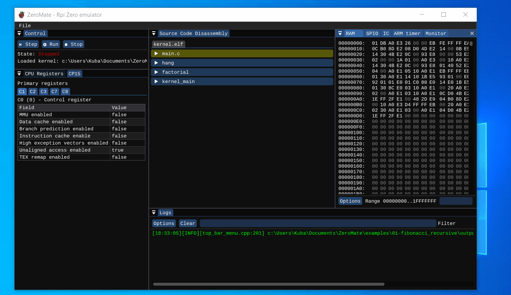

# 01 - factorial recursive

## Description

This examples comes from an early stage of the project development. Its main purpose is to test function calls which implicitly utilizes the stack as well as a number of essential instructions.

The kernel recursively calculates `7!` and then halts the CPU. The result of the operation can be found in register R0, which is used to store the return value from a function.

## Demo

