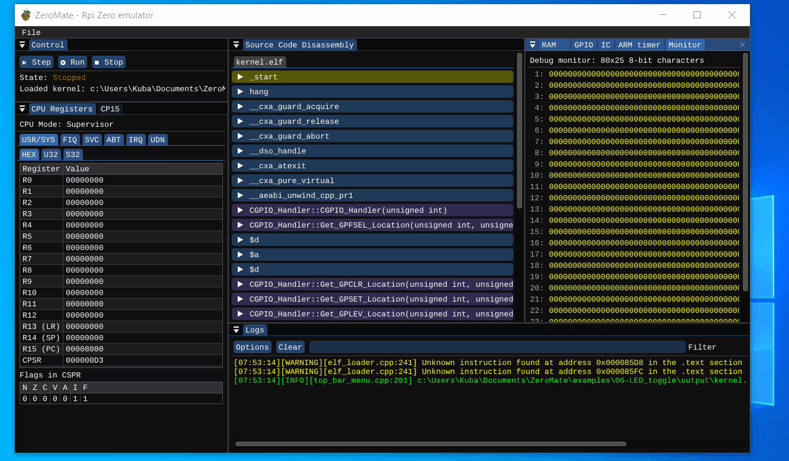

# 06 - LED toggle

## Description

This example is the first example that interacts with GPIO pins. In particular, it periodically turns on and off the built-in LED, which is internally connected to GPIO pin 47. Once the kernel is executed, the pin activity can be view in the GPIO window of the emulator.

## Demo

