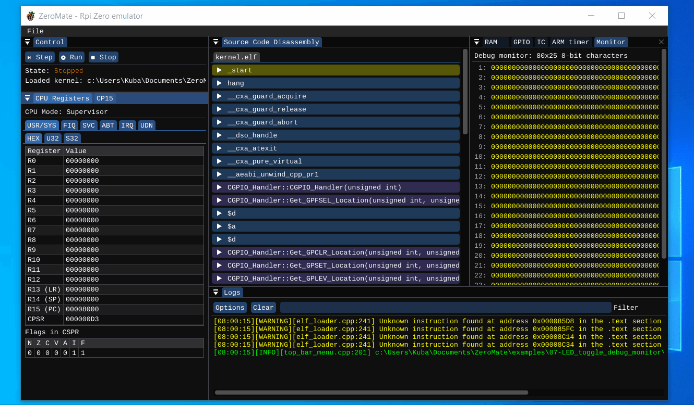

# 07 - LED toggle & debug monitor

## Description

Similarly to example [06-LED_toggle](../06-LED_toggle/README.md). It periodically toggles the built-in LED (GPIO pin 47). Additionally, it tests out the [debug monitor](../../tools/README.md), which is used as a debugging tool. Keep in mind though that this memory-mapped peripheral is not part of the Raspberry Pi Zero board.

## Demo

