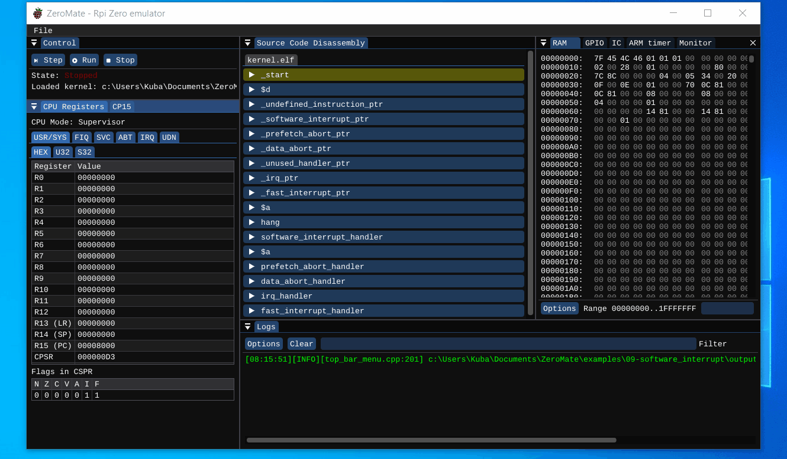

# SW interrupt

## Description

This examples tests out the use of CPU exceptions. In particular, this examples uses the following piece of code to throw a SW interrupt exception.

```c++
    .
    .
    .

	svc 0 ;@ Throw a SW interrupt exceptions.

hang:
	b hang
```

 If implemented correctly, the CPU should then fetch the address of the corresponding handler from the IVT (interrupt vector table) and call it. The following snipped of code is the actual handler of a SW interrupt execption.

 ```c++
 extern "C" void __attribute__((interrupt("SWI"))) software_interrupt_handler()
{
    int count = 0;
    for (int i = 0; i < 10; ++i)
        count++;
}
 ``` 

In this example, it does not do anything useful - it contains a piece of dummy code.

## Demo

The proper call of a SW exception can be tested by setting a breakpoint to the address of the `svc` instruction. Once the code execution stops at this instruction, we can step through the code twice to jump into the exception handler - the first step retrieves the address from the IVT, and the second step performs the jump itself.

