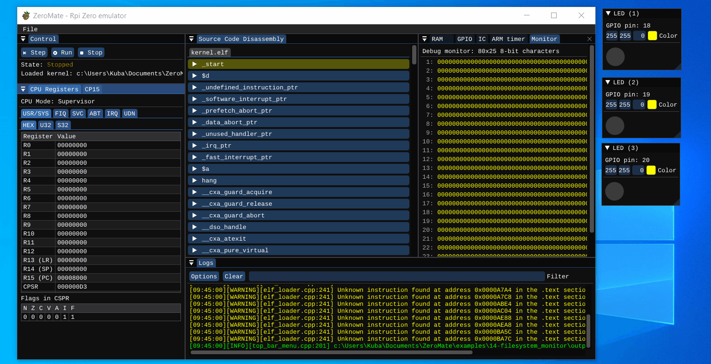

# 14 - filesystem monitor

This examples tests the implementation of an in-memory filesystem, which is used as an abstraction between system resources and user [processes](kernel/src/test_processes.cpp).

It prints out information regarding the creation of the filesystem to the debug monitor. Then, it creates three processes that take advantage of the filesystem to access and toggle GPIO pins. The fourth process prints the string "Hello!" to the debug monitor.

## External peripherals

Here is the content of [peripherals.json](../../peripherals.json) used in this example. It connects three LEDs to GPIO pins 18, 19, and 20.

```json
{
  "peripherals": [
    {
      "name" : "LED (1)",
      "connection" : [ 18 ],
      "lib_dir" : "peripherals",
      "lib_name" : "led"
    },
    {
      "name" : "LED (2)",
      "connection" : [ 19 ],
      "lib_dir" : "peripherals",
      "lib_name" : "led"
    },
    {
      "name" : "LED (3)",
      "connection" : [ 20 ],
      "lib_dir" : "peripherals",
      "lib_name" : "led"
    }
  ]
}
```

## Demo

