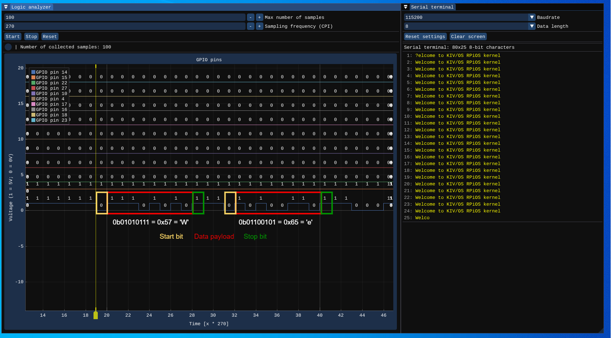

# 18 - UART

## Description

The UART example demonstrates a simple use of the UART communication between the emulator and a serial terminal that was implemented as an external peripheral.

There are two `.elf` files for this example the user can try out. They both transmit the message `Welcome to KIV/OS RPiOS kernel\r\n` over UART. However, they use different baudrates. The user needs to set the appropriate baudate in the serial terminal as well. 

## Simplifications

As the serial terminal does not have its own internal clock, it is derived directly from the emulator. In reality, there is not synchronization taking place between the two devices whatsoever. Nevertheless, the user still needs to set the baudrate properly for the communication to work as expected.

## External peripherals

Here is the content of [peripherals.json](../../peripherals.json) used in this example.

```json
{
  "peripherals": [
    {
      "name" : "Logic analyzer",
      "connection" : [ 14, 15, 22, 27, 10, 4, 17, 16, 18, 23 ],
      "lib_dir" : "peripherals",
      "lib_name" : "logic_analyzer"
    },
    {
      "name" : "Serial terminal",
      "connection" : [ 14, 15 ],
      "comment" : "pins: [TX, RX]",
      "lib_dir" : "peripherals",
      "lib_name" : "serial_terminal"
    }
  ]
}
```

## Demo


The first few frames can be decoding as follows:

```
Received data by the serial terminal: 0111010101110101001101110001101101110110001101 
```

```
0 11101010 1 -> 01010111 (0x57 = 'W')
11
0 10100110 1 -> 01100101 (0x65 = 'e')
11
0 00110110 1 -> 01101100 (0x6C = 'l')
11
0 11000110 1 -> 01100011 (0x63 = 'c')
```

