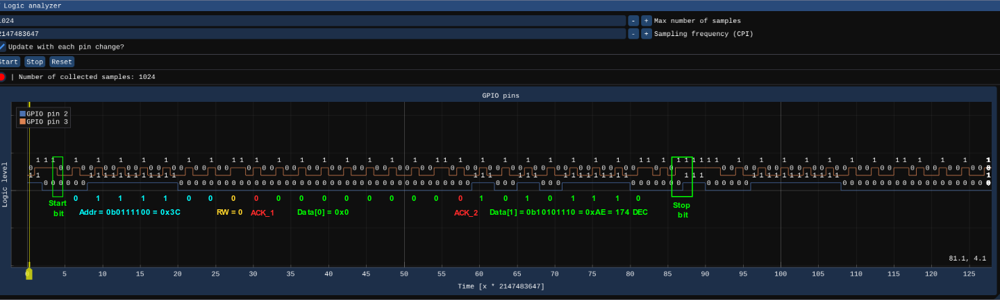

# 19 - I2C

## Description

This example demonstrates the use of an SSD1306 OLED display that is controlled over I2C. There are two user [tasks](kernel/src/test_processes.cpp) created within this example.

1) Process 1 (dummy tasks that blinks an LED)
2) Process 6
   - Reads random numbers from the TRNG peripheral and prints out messages to the OLED display. Here is a list of possible messages that may appear on the display (based on the random number):

     ```c++
     const char* messages[] = 
     {
         "I blink, therefore I am.",        
         "I see dead pixels.",
         "One CPU rules them all.",         
         "My favourite sport is ARM wrestling",
         "Old MacDonald had a farm, EIGRP",
     };
     ```

## Parameters of the I2C protocol

- **Clock** (SCL line) is triggered by a rising edge
- **Start bit** is represented by the SDA line going from HIGH to LOW
- **Stop bit** is represented by the SDA line going HIGH after the SCL line has already been set to HIGH

## External peripherals

Here is the content of [peripherals.json](../../peripherals.json) used in this example.

```json
{
  "peripherals": [
    {
      "name" : "SSD1306 OLED",
      "connection" : [ 3, 2, 60 ],
      "comment" : "connection: [SCL, SDA, address]",
      "lib_dir" : "peripherals",
      "lib_name" : "ssd1306_oled"
    },
    {
      "name" : "Logic analyzer",
      "connection" : [ 2, 3 ],
      "comment" : "connection: [SDA, SCL]",
      "lib_dir" : "peripherals",
      "lib_name" : "logic_analyzer"
    }
  ]
}
```

## Demo


Using the [logic analyzer](../../peripherals/logic_analyzer/README.md), we can capture and debug I2C communication. In the picture below, you can see two bytes worth of payload being sent to the target device.



```
Address = 0x3C (60 DEC)
Data[0] = 0x00 (Command_Start)
Data[1] = 0xAE (Display_Off)
```