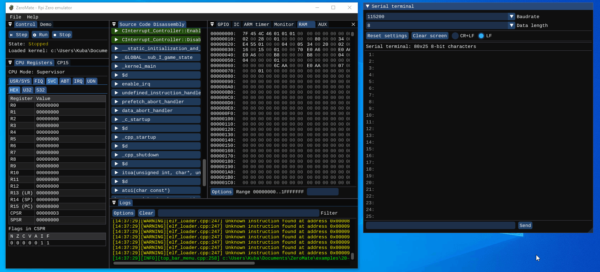
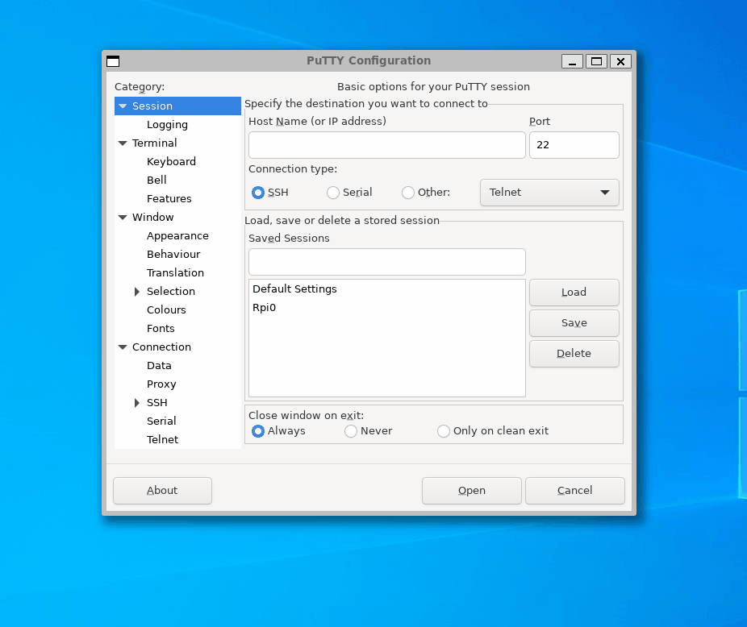

# 20 - UART Game

The goal of this example is to demonstrate the use of bidirectional interrupt-driven UART communication.

## Description

 It is done by playing a simple number guessing game between the kernel and the user. The user is supposed to think of a number and the kernel guesses what it is by asking the user whether their number is greater than a certain value. The user interacts with the kernel by either entering `y` (yes) or `n` (no) to each question they get asked.

## External peripherals

Here is the content of [peripherals.json](../../peripherals.json) used in this example.

```json
{
  "peripherals": [
    {
      "name" : "Serial terminal",
      "connection" : [ 14, 15 ],
      "comment" : "pins: [TX, RX]",
      "lib_dir" : "peripherals",
      "lib_name" : "serial_terminal"
    }
  ]
}
```

## Demo



You can also try out this game using real HW as shown in the gif below. The kernel remains identical.

