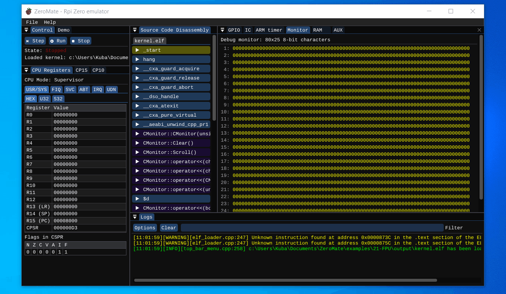

# 21 - FPU

This example demonstrates a simple use of single-precision floating point numbers (coprocessor 10 - single-precision FPU). Double precision floating point numbers (coprocessor 11) are not supported at the moment.

## Description

In [main.cpp](kernel/src/main.cpp), there is an infinite loop that renders the sinus wave to the [debug monitor](../../tools/README.md). The whole process of rendering the wave consists of multiple floating-point-related steps that are supposed to demonstrate the use of CP10 (coprocessor 10).

### Initialization of CP10

```asm
mrc p15, 0, r6, c1, c0, 2
orr r6, r6, #0x300000
mcr p15, 0, r6, c1, c0, 2
mov r6, #0x40000000
fmxr fpexc, r6
```

| ⚠️ WARNING: Every floating point constant in the source code must be explicitly suffixed with an `F` - e.g. `10.1599F` |
|--|

## Demo


