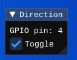

# DIP switch

The dip switch works almost the same as a regular button. The only different is that it stays in its last state (position) until manually changed by the user.



## Configuration

```json
{
  "peripherals": [
    {
      "name" : "DIP switch",
      "pins" : [ 6 ],
      "lib_dir" : "peripherals",
      "lib_name" : "dip_switch"
    }
  ]
}
```