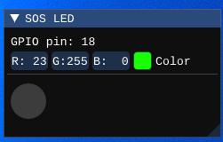

# LED

The LED is an output peripheral that has read-only access to the GPIO pin it is connected to. The user can set the color as they wish using the color picker, which can come in handy, for example, when simulating a traffic light.



## Configuration

```json
{
  "peripherals": [
    {
      "name" : "LED",
      "pins" : [ 47 ],
      "lib_dir" : "peripherals",
      "lib_name" : "led"
    }
  ]
}
```