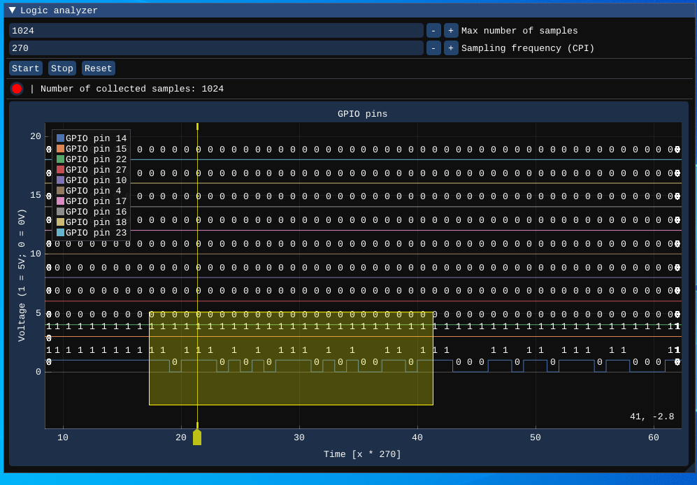

# Logic analyzer

The logic analyzer can be used to view raw bits of various kinds communications between external devices and the emulator itself. The user can connect it to any GPIO pins they wish. The only thing they need to do is to set the maximum number of samples that should be captured and the sampling frequency, which is essentially a prescaler of the CPU clock.

For instance, if the user wants the view the UART communication, they can set the sampling frequency to 270, assuming the default clock rate is 250000000 and the baudrate is 115200.

```c++
const unsigned int val = ((hal::Default_Clock_Rate / static_cast<unsigned int>(rate)) / 8) - 1;
```



## Configuration

```json
{
  "peripherals": [
    {
      "name" : "Logic analyzer",
      "pins" : [ 14, 15, 22, 27, 10, 4, 17, 16, 18, 23 ],
      "lib_dir" : "peripherals",
      "lib_name" : "logic_analyzer"
    }
  ]
}
```