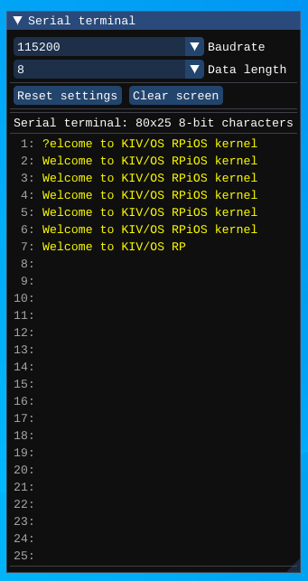

# Serial terminal

The serial terminal needs to be connected to GPIO pins - RX, and TX. It communicates via the UART protocol. The user can transmit data using the text input located at the bottom part of the window.



## Configuration

```json
{
  "peripherals": [
    {
      "name" : "Serial terminal",
      "pins" : [ 14, 15 ],
      "comment" : "pins: [RX, TX]",
      "lib_dir" : "peripherals",
      "lib_name" : "serial_terminal"
    }
  ]
}
```