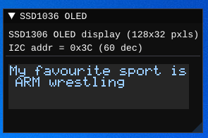

# SSD1306 OLED display

The display is controlled over the I2C communication bus. The functionality of the display has been notably simplified. However, it has been implemented, so it could easily be extended in the future if needed. In terms of its current implementation, it is intended to be interacted with in a manner similar to that of [KIV-RTOS](https://github.com/MartinUbl/KIV-RTOS).



## Configuration

```json
{
  "peripherals": [
    {
      "name" : "SSD1306 OLED",
      "connection" : [ 3, 2, 60 ],
      "comment" : "connection: [SCL, SDA, I2C addr]",
      "lib_dir" : "peripherals",
      "lib_name" : "ssd1306_oled"
    }
  ]
}
```